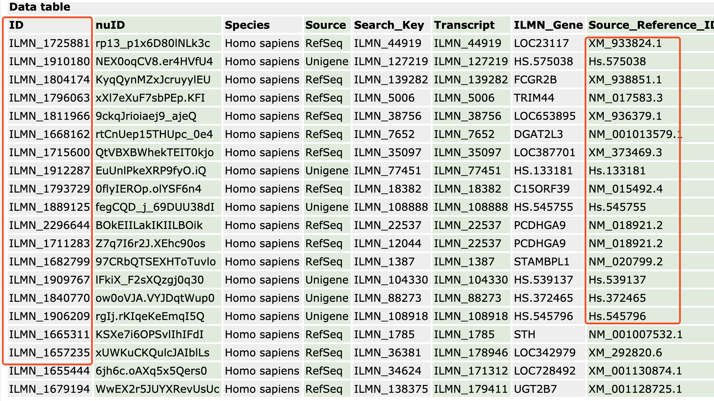
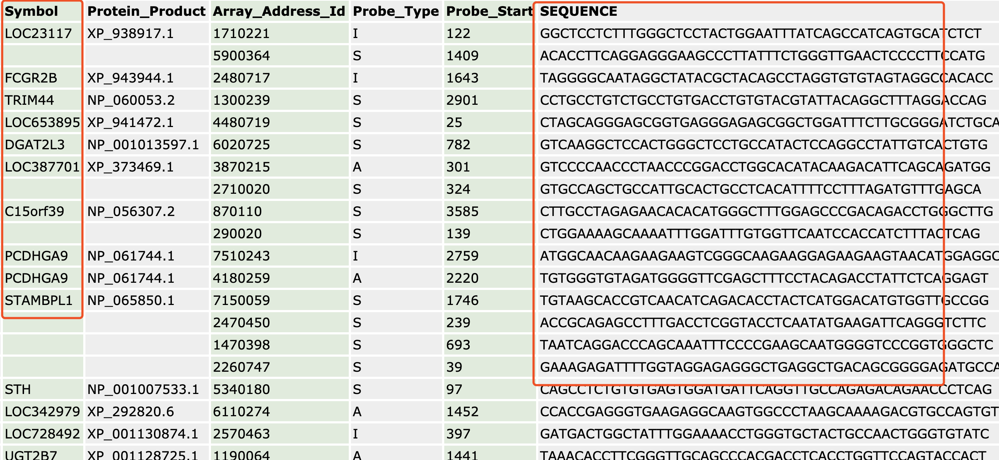
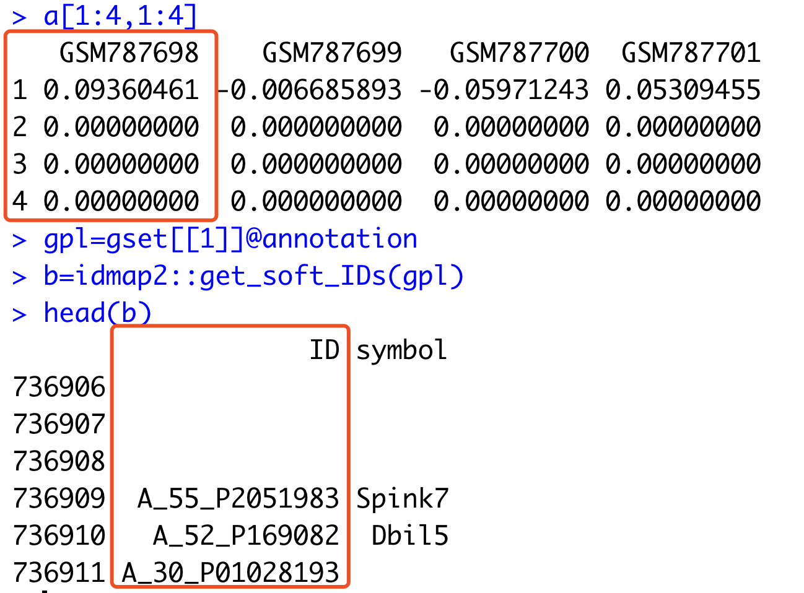

# 整合全部表达芯片平台的soft文件并且提取基因symbol和探针对应关系

前面我们提到过表达芯片探针注释的3种方法，参见：[第一个万能芯片探针ID注释平台R包](https://mp.weixin.qq.com/s/CzV9zv0AbhhfTalVomTGCw), 并且帮助大家搞定了第一种bioconductor包的方法，大家**无需下载几十个bioconductor包**，然后自己一个个提取基因信息，我全部为大家做好啦，也就是 **idmap1** 这个目前host在GitHub的R包：

- https://github.com/jmzeng1314/idmap1

现在我们来说说第二个万能芯片探针ID注释平台包。一定要跟我们的 **idmap1** 区分开来哦，那个**idmap1**仅仅是把bioconductor里面有的37个芯片平台整合了一下，而我们的这个**idmap2**包不得了啦，有122个GPL之多，它们的6G多的soft信息被我下载整理成为了不到40M的R包。

### 首先理解芯片平台的soft信息

NCBI官网可以下载所有的gpl平台的soft信息，会比较大（100多个平台全部下载需要6G以上的空间）

- http://www.ncbi.nlm.nih.gov/geo/query/acc.cgi?acc=GPL6947

不同的gpl平台的soft信息不一样，一般来说，大家关心的其实就是探针的ID，以及基因的symbol列。



有一些平台还会提供探针序列：



我已经帮助大家下载整理好了全部的GPL平台的芯片探针列，以及其对应的基因列，整理打包成为一个R包方便大家使用，直接获取探针对应的基因symbol即可。

### 安装我的idmap2包

一定要跟我们的 idmap1 区分开来哦，那个idmap1是把bioconductor里面有的37个芯片平台整合了一下，而我们的这个idmap2包不得了啦，有122个GPL之多，它们的6G多的soft信息被我下载整理成为了不到40M的R包。

```r
library(devtools)
install_github("jmzeng1314/idmap2")
library(idmap2)
```

因为有40M，所以下载安装会比较慢哦，喝杯咖啡吧！也欢迎**赞助我一杯咖啡**，我们一起喝！

同样的获取同样的**GPL570	hgu133plus2	[HG-U133_Plus_2] Affymetrix Human Genome U133 Plus 2.0 Array**注释信息，一行代码就搞定！

```
library(idmap1)
ids=getIDs('gpl570')
head(ids)
library(idmap2)
ids=get_soft_IDs('gpl570')
head(ids)
```

可以看到两个包的两个函数非常类似，只需要你提供gpl即可，是不是很方便啦！

当然了，第二个包有一百多个平台，而第一个只有37个，注意哦，比如

```
idmap1::getIDs('GPL13912') # 失败
idmap2::get_soft_IDs('GPL13912') # 成功
```

这个 **GPL13912** 平台，就存在于第二个包，但是不在第一个哈。

你想知道我们支持哪些平台吗，当然是可以看的：

```
data(gpl_list)
gpl_list[,1:4]
```

希望你的平台，在我们的列表，能帮助你进行芯片注释。

### 一个芯片数据挖掘实战

结合我们发布的 [GEO数据库中国区镜像横空出世](https://mp.weixin.qq.com/s/0rXp-n4NvCmwqh4eyGJvQw)，随时随地方便下载GEO数据集，并且进行ID转换！

```r
library(GEOmirror)
library(idmap1) 
library(idmap2) 
gset=geoChina('GSE31731') 
gset
a=exprs(gset[[1]])
a[1:4,1:4]
gpl=gset[[1]]@annotation
b=idmap2::get_soft_IDs(gpl)
head(b)
```

可以看到， 有一些表达矩阵，虽然是芯片做的，但是作者其实并不太懂，上传的时候把探针都漏掉了。不过，还是可以按照行慢慢对应过来。



